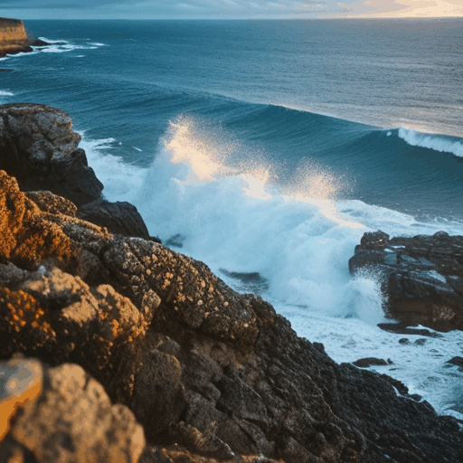
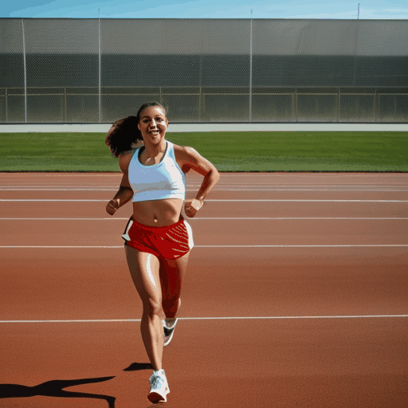
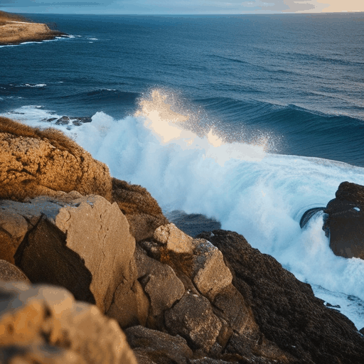
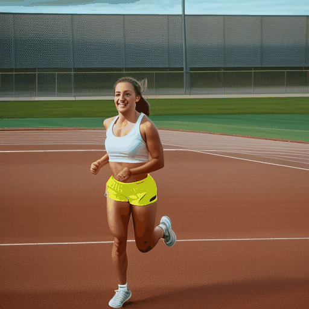
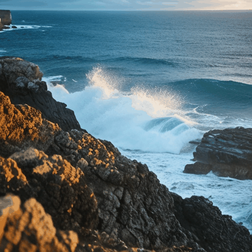
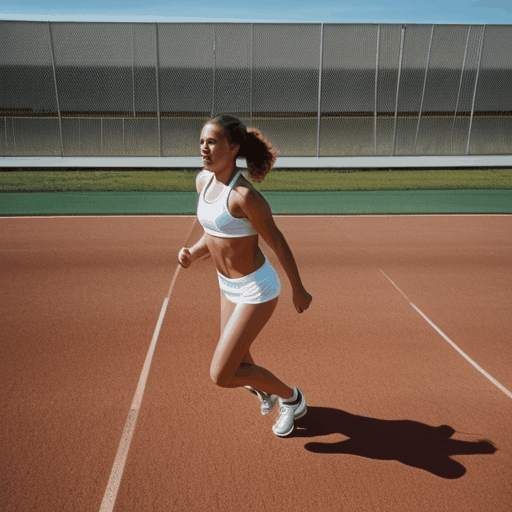
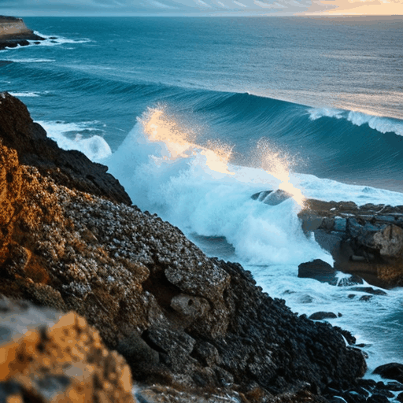

# AnimateDiff - Custom Motion Module LoRA (Slow Motion Edition)
This repository is a fork of the official AnimateDiff implementation. It focuses on training and fine-tuning Custom Motion LoRAs, specifically optimized for High-Quality Slow Motion effects.

## Key Features & Enhancements
- **Slow Motion LoRA Training:** Includes custom configurations and datasets for ultra-smooth slow-motion fluid dynamics (waves, splashes).
- **Workflow Tools:**
  - event_cut.py: Custom script for processing and cutting training video clips.
  - 爬虫.py: Automated tool for gathering high-quality training datasets.
- **Optimized Training Configs:** Custom YAML files located in configs/training/v2/.

## Slow Motion LoRA Progression (Training Results)
| versions | training steps | alpha | cfg | effect preview 1              | effect preview 2            |
|:---------|:---------------|:------|:----|:------------------------------|:----------------------------|
| 1        | 3000           | 0.7   | 7   |  |  |
| 2        | 1000           | 0.7   | 7   |  |  |
| 3        | 3000           | 1.0   | 7   |  |  |
| 4        | 3000           | 0.7   | 10  |  |                             |
| 5        | 3000           | 4.0   | 7   |  |                             |


## Quick Start
### 1. Environment Setup
Same as official AnimateDiff:
```bash
git clone https://github.com/Shelly-icecream/AnimateDiff-Motion-Module-LoRA.git
cd AnimateDiff-Motion-Module-LoRA
pip install -r requirements.txt
```
### 2. Training your own Motion LoRA
Use the optimized config provided in this repo:
```bash
python train.py --config configs/training/v2/training_motionlora.yaml
```
### 3. Inference with Slow Motion LoRA
To test the v6 LoRA, update your prompt config to include the LoRA path and use "<slowmo>" prompts.

## Acknowledgements
This project is built upon the incredible work of the AnimateDiff team:
**[AnimateDiff: Animate Your Personalized Text-to-Image Diffusion Models without Specific Tuning](https://arxiv.org/abs/2307.04725)** [Yuwei Guo](https://guoyww.github.io/), [Ceyuan Yang](https://ceyuan.me/), [Anyi Rao](https://anyirao.com/), et al.
We thank the authors for their excellent work.

## Citation
If you find this project useful, please cite:
```bibtex
@misc{zhang2026motionlora,
  author       = {Xueli Zhang},
  title        = {AnimateDiff Motion Module LoRA for Slow Motion Generation},
  year         = {2026},
  howpublished = {\url{https://github.com/Shelly-icecream/AnimateDiff-Motion-Module-LoRA}},
  note         = {GitHub repository}
}
```
This project is built upon AnimateDiff. Please also cite the original work:
```bibtex
@article{guo2023animatediff,
  title={AnimateDiff: Animate Your Personalized Text-to-Image Diffusion Models without Specific Tuning},
  author={Guo, Yuwei and Yang, Ceyuan and Rao, Anyi and Liang, Zhengyang and Wang, Yaohui and Qiao, Yu and Agrawala, Maneesh and Lin, Dahua and Dai, Bo},
  journal={arXiv preprint arXiv:2307.04725},
  year={2023}
}
```

## Disclaimer
This repository is for academic and research purposes. Please follow the license of the original AnimateDiff and Stable Diffusion models.