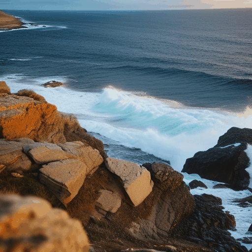
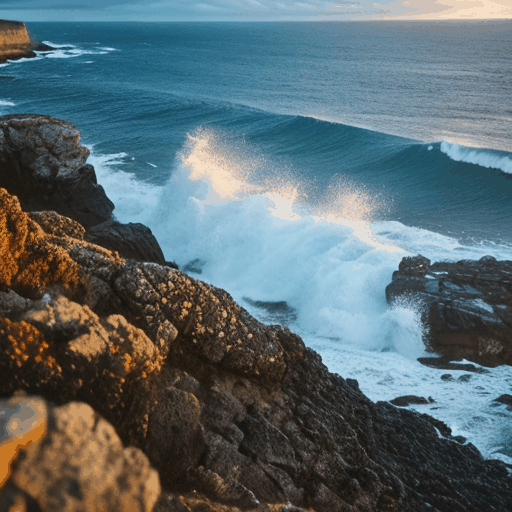
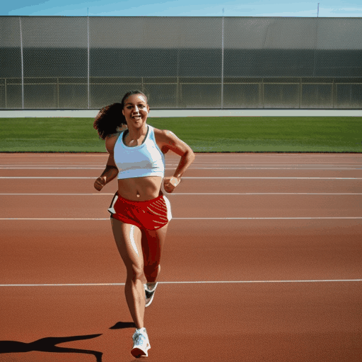
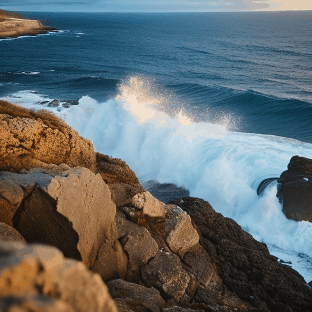
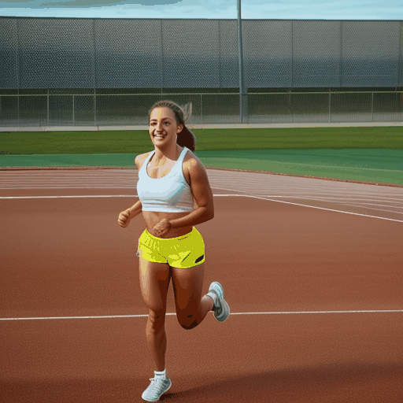
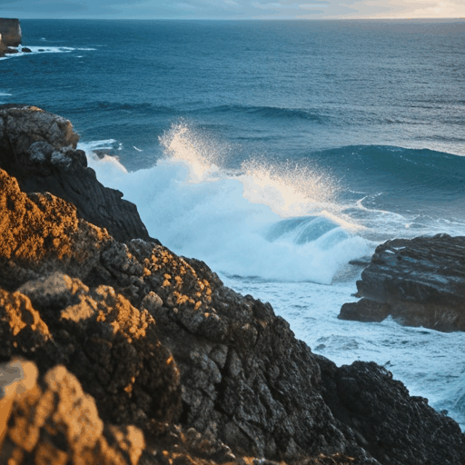
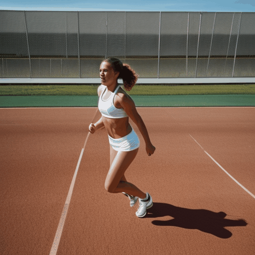
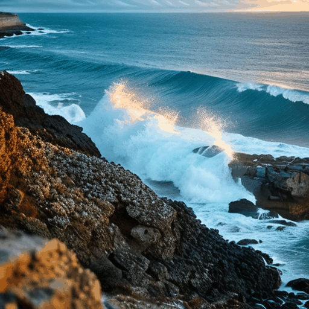

# AnimateDiff - Custom Motion Module LoRA (Slow Motion Edition)
This repository is a fork of the official AnimateDiff implementation. It focuses on training and fine-tuning Custom Motion LoRAs, specifically optimized for High-Quality Slow Motion effects.

## Key Features & Enhancements
- **Slow Motion LoRA Training:** Includes custom configurations and datasets for ultra-smooth slow-motion fluid dynamics (waves, splashes).
- **Workflow Tools:**
  - `scripts/data/event_cut.py`: Custom script for processing and cutting training video clips.
  - `scripts/data/download_videos.py`: Automated tool for gathering training videos.
  - `animatediff/data/video_dataset.py` and `slowmo.py`: Training sample loading and slow-motion scoring.
- **Optimized Training Configs:** Custom YAML files located in configs/training/v2/.

## Slow Motion LoRA Progression (Training Results)
| versions | training steps | alpha | cfg | effect preview 1              | effect preview 2            |
|:---------|:---------------|:------|:----|:------------------------------|:----------------------------|
| 1        | 3000           | 0.0   | 7   |  |                             |
| 2        | 3000           | 0.7   | 7   |  |  |
| 3        | 1000           | 0.7   | 7   |  |  |
| 4        | 3000           | 1.0   | 7   |  |  |
| 5        | 3000           | 0.7   | 10  |  |                             |
| 6        | 3000           | 4.0   | 7   |  |                             |


## Quick Start
Run the following commands from the repository root. Relative data paths are resolved from the current working directory.

### 1. Environment Setup
Same as official AnimateDiff:
```bash
git clone https://github.com/Shelly-icecream/AnimateDiff-Motion-Module-LoRA.git
cd AnimateDiff-Motion-Module-LoRA
pip install -r requirements.txt
pip install opencv-python yt-dlp tqdm
```
### 2. Download pretrained models and checkpoints
```bash
pip install -U huggingface_hub
huggingface-cli download runwayml/stable-diffusion-v1-5 \
  --local-dir stable-diffusion-v1-5 \
  --local-dir-use-symlinks False
huggingface-cli download guoyww/animatediff \
  mm_sd_v15_v2.ckpt \
  --local-dir models/Motion_Module \
  --local-dir-use-symlinks False
```
https://huggingface.co/Shellyice/animatediff-motion-lora/blob/main/motionlora-step-1000.ckpt
https://huggingface.co/Shellyice/animatediff-motion-lora/blob/main/motionlora-step-3000.ckpt

If using the local Stable Diffusion download above, set `pretrained_model_path: "stable-diffusion-v1-5"` in the training YAML. The default configuration uses the Hugging Face model ID instead.

### 3. Prepare training data
The download script saves videos into the folders named in its `tasks` dictionary. Edit its queries as needed:

```bash
python scripts/data/download_videos.py
```

Place the downloaded videos directly in `data/raw/`, then cut them into training clips:

```bash
python scripts/data/event_cut.py
```

The cutter reads `data/raw/` (not recursively) and writes clips under `data/clips/`. Training recursively reads `.mp4` files from `train_data.root_dir`, currently `data/clips`. Add an optional same-name `.txt` file beside each clip for its caption; missing captions become empty strings before any slow-motion tag is added. The cutter does not generate captions.

### 4. Train Motion LoRA
Edit `configs/training/v2/training_motionlora.yaml` for model paths, `train_data.root_dir`, LoRA `rank`/`alpha`, and training settings. Launch single-GPU training with:

```bash
torchrun --standalone --nproc_per_node=1 train.py \
  --launcher pytorch \
  --config configs/training/v2/training_motionlora.yaml
```

Checkpoints are written under `outputs/motionlora_train/<run-name>/checkpoints/`. They contain LoRA A/B weights, epoch, and global step, rather than the base model or full optimizer state. Keep the matching base model and Motion Module available for inference.

The default run uses 3,000 training steps and saves checkpoints every 500 steps and at epoch ends. Validation sampling is effectively disabled by `validation_steps: 999999`; set it to `500` to generate previews during training.

### 5. Inference with Slow Motion LoRA
In `configs/prompts/2_motionlora/2_motionlora_RealisticVision.yaml`, replace the example LoRA checkpoint paths with your own and prepare the configured Motion Module and RealisticVision checkpoint (`dreambooth_path`). Each list entry is a separate generation configuration.

```bash
python -m scripts.animate \
  --pretrained-model-path stable-diffusion-v1-5 \
  --config configs/prompts/2_motionlora/2_motionlora_RealisticVision.yaml
```

The inference `motion_module_lora_configs[].alpha` scales the merged LoRA update. It differs from the training `alpha`, which is divided by `rank` inside `LoRALinear`; the defaults `alpha: 8` and `rank: 8` give a training scale of 1. If you change that ratio, account for it when setting the inference scale.

## Acknowledgements
This project is built upon the incredible work of the AnimateDiff team:
**[AnimateDiff: Animate Your Personalized Text-to-Image Diffusion Models without Specific Tuning](https://arxiv.org/abs/2307.04725)** [Yuwei Guo](https://guoyww.github.io/), [Ceyuan Yang](https://ceyuan.me/), [Anyi Rao](https://anyirao.com/), et al.
We thank the authors for their excellent work.

## Citation
If you find this project useful, please cite:
```bibtex
@misc{zhang2026motionlora,
  author       = {Xueli Zhang},
  title        = {AnimateDiff Motion Module LoRA for Slow Motion Generation},
  year         = {2026},
  howpublished = {\url{https://github.com/Shelly-icecream/AnimateDiff-Motion-Module-LoRA}},
  note         = {GitHub repository}
}
```
This project is built upon AnimateDiff. Please also cite the original work:
```bibtex
@article{guo2023animatediff,
  title={AnimateDiff: Animate Your Personalized Text-to-Image Diffusion Models without Specific Tuning},
  author={Guo, Yuwei and Yang, Ceyuan and Rao, Anyi and Liang, Zhengyang and Wang, Yaohui and Qiao, Yu and Agrawala, Maneesh and Lin, Dahua and Dai, Bo},
  journal={arXiv preprint arXiv:2307.04725},
  year={2023}
}
```

## Disclaimer
This repository is for academic and research purposes. Please follow the license of the original AnimateDiff and Stable Diffusion models.
